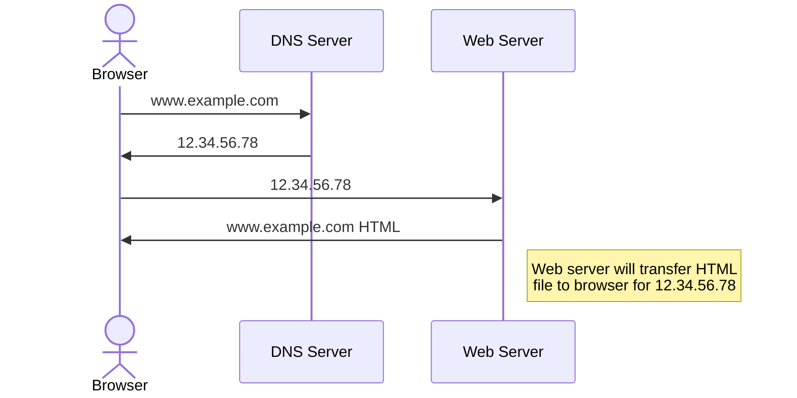

In today's digital age, understanding how the internet works is crucial for navigating the online world effectively. Whether you're a student, a professional, or simply a curious individual, this post aims to shed light on the foundational elements that make the internet such a powerful tool.

## The History of the Internet

The internet as we know it today has its roots in the 1960s, when the United States Department of Defense developed ARPANET, a pioneering network that laid the foundation for the modern internet. Over the decades, the internet has evolved into a global network of interconnected devices, enabling instant communication and access to information worldwide.

## How Data is Transmitted Across the Web

At its core, the internet is a vast network of computers that communicate with each other using a common language known as the Internet Protocol (IP). When you request a web page or send an email, data is broken down into packets and transmitted across the internet via a series of routers and servers until it reaches its destination.

## The Importance of Protocols like HTTP and HTTPS

HTTP (Hypertext Transfer Protocol) and its secure counterpart, HTTPS, are protocols that govern how information is transmitted between web servers and clients. HTTP defines how web browsers and servers communicate, while HTTPS adds a layer of encryption to protect sensitive data.

## What's DNS ?

DNS stands for Domain Name System. It is a decentralized naming system for computers, services, or any resource connected to the Internet or a private network. It translates easily memorizable domain names (like example.com) to the numerical IP addresses (like 192.0.2.1) needed for locating and identifying computer services and devices with the underlying network protocols. DNS also specifies the structure of the domain names hierarchy and provides distributed, fault-tolerant, and reliable mechanisms for domain name resolution.

## HTTP Status Codes

HTTP status codes are three-digit numbers returned by a web server in response to a client's request made to the server. They convey information about the status of the request and help troubleshoot potential issues. Here are some common HTTP status codes:

1. **1xx - Informational:**
   - 100 Continue: The server has received the initial part of the request and is awaiting the rest.
   - 101 Switching Protocols: The server is changing protocols per the client's request.

2. **2xx - Success:**
   - 200 OK: The request was successful.
   - 201 Created: The request has been fulfilled, resulting in the creation of a new resource.
   - 204 No Content: The server successfully processed the request but is not returning any content.

3. **3xx - Redirection:**
   - 301 Moved Permanently: The requested resource has been permanently moved to a new URL.
   - 302 Found: The requested resource has been temporarily moved to a different URL.
   - 304 Not Modified: The resource has not been modified since the last request.

4. **4xx - Client Error:**
   - 400 Bad Request: The server cannot process the request due to a client error.
   - 401 Unauthorized: The request requires user authentication.
   - 403 Forbidden: The server understood the request but refuses to authorize it.

5. **5xx - Server Error:**
   - 500 Internal Server Error: A generic error message indicating that something has gone wrong on the server.
   - 502 Bad Gateway: The server received an invalid response from an upstream server.
   - 503 Service Unavailable: The server is currently unable to handle the request due to temporary overloading or maintenance.

Check [MDN Web Docs](https://developer.mozilla.org/en-US/docs/Web/HTTP/Status) for more information on HTTP status codes.

These status codes provide valuable information to both clients and developers, aiding in troubleshooting and improving the web browsing experience.

## Port Number

A port number is a way to identify a specific process or service on a computer in a networked environment. In the context of the internet, ports allow multiple services or processes to run on the same device while ensuring that incoming traffic is directed to the correct application.

Port numbers are divided into three ranges:

1. **Well-known ports (0-1023):** These are reserved for system services or commonly used applications. For example, HTTP typically uses port 80, and HTTPS uses port 443.

2. **Registered ports (1024-49151):** These can be used by user processes or applications. They are not assigned by the Internet Assigned Numbers Authority (IANA) but are registered with IANA.

3. **Dynamic or private ports (49152-65535):** These can be used by any application and are often assigned dynamically by the operating system.

When a client wants to communicate with a server, it includes the port number along with the server's IP address to ensure that the data reaches the correct application on the server.

## HTTP Request Methods

HTTP (Hypertext Transfer Protocol) defines several request methods to indicate the desired action to be performed for a given resource. Here are some common HTTP request methods:

1. **GET:** Requests a representation of the specified resource. GET requests should only retrieve data and should not have any other effect on the server.

2. **POST:** Submits data to be processed to the specified resource. The data is included in the body of the request. POST requests are often used for submitting forms or uploading files.

3. **PUT:** Uploads a representation of the specified resource. PUT requests are idempotent, meaning that multiple identical requests should have the same effect as a single request.

4. **DELETE:** Deletes the specified resource. DELETE requests are also idempotent.

5. **PATCH:** Applies partial modifications to a resource. The data to be modified is included in the body of the request.

6. **HEAD:** Requests the headers that would be returned if the HEAD request's URL was instead requested with the GET method. This is useful for checking what headers a GET request would return without actually fetching the resource.

7. **OPTIONS:** Returns the HTTP methods that the server supports for the specified URL. This can be used to check the capabilities of a server.

These HTTP request methods allow clients to interact with web servers in a variety of ways, enabling the creation of dynamic and interactive web applications.

## HTTP Request Headers

HTTP request headers are key-value pairs sent by a client to a server to provide additional information about the request or the client itself. Here are some common HTTP request headers:

1. **Host:** Specifies the domain name of the server (e.g., example.com) and, optionally, the port number.

2. **User-Agent:** Provides information about the client making the request, such as the browser or application name and version.

3. **Accept:** Specifies the media types that are acceptable for the response. This helps the server understand what kind of content the client can handle.

4. **Accept-Language:** Specifies the preferred natural language for the response.

5. **Accept-Encoding:** Specifies the encoding algorithms that are acceptable for the response body.

6. **Authorization:** Contains credentials for authenticating the client with the server.

7. **Content-Type:** Specifies the media type of the request body.

8. **Content-Length:** Specifies the size of the request body in bytes.

9. **Referer (sic):** Specifies the URL of the page that linked to the resource being requested.

10. **Cookie:** Contains stored HTTP cookies that are sent with the request.

11. **Connection:** Specifies whether the client would like to keep the connection open for further requests.

These headers provide important information to the server and can influence how the server handles the request and generates the response.

**Conclusion:**
In conclusion, the internet is a complex and ever-evolving network that has revolutionized the way we communicate, work, and access information. By understanding the basics of web and internet fundamentals, you can navigate this digital landscape with confidence and make the most of its vast resources.

From the history of the internet to the intricacies of protocols like HTTP and HTTPS, each concept covered in this post plays a crucial role in shaping our online experience. Whether you're a student, a professional, or simply someone curious about the world wide web, the knowledge gained from this post can help you become a more informed and empowered user of the internet.

As technology continues to advance, so too will the internet, offering new opportunities and challenges along the way. By staying informed and understanding the fundamental principles of the web, you can stay ahead of the curve and make the most of this incredible tool.

Thank you for joining on this journey through the basics of web - internet fundamentals. I hope you found this post informative and insightful. Stay tuned for more articles and updates on the ever-changing world of technology and the internet.
