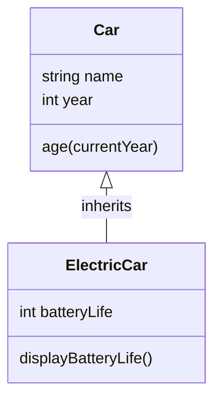

JavaScript, a versatile programming language, introduced classes as a syntactical sugar for creating objects in ECMAScript 2015 (ES6). This blog post will explore the concepts of classes and objects in JavaScript, highlighting their syntax, features, and practical applications.

### What is a Class?

A **class** in JavaScript serves as a blueprint for creating objects. It encapsulates data and methods that operate on that data, providing a structured way to define object properties and behaviors.

#### Key Features of Classes

- **Constructor**: A special method called when an object is instantiated. It initializes the object's properties.
- **Methods**: Functions defined within the class that describe the behaviors of the objects.
- **Inheritance**: Classes can inherit properties and methods from other classes, promoting code reuse.

### Class Syntax

The basic syntax for defining a class in JavaScript is as follows:

```javascript
class ClassName {
    constructor(parameters) {
        // Initialization code
    }

    methodName() {
        // Method code
    }
}
```

### Example of a Class

Let’s consider a simple example of a `Car` class:

```javascript
class Car {
    constructor(name, year) {
        this.name = name;
        this.year = year;
    }

    age(currentYear) {
        return currentYear - this.year;
    }
}

// Creating instances of Car
const myCar1 = new Car("Ford", 2014);
const myCar2 = new Car("Audi", 2019);

console.log(`My ${myCar1.name} is ${myCar1.age(2024)} years old.`);
console.log(`My ${myCar2.name} is ${myCar2.age(2024)} years old.`);
```

### Creating Objects

Objects are instances of classes. When you create an object using the `new` keyword, the constructor method initializes its properties:

```javascript
const myCar = new Car("Toyota", 2020);
console.log(myCar); // Output: Car { name: 'Toyota', year: 2020 }
```

### Accessing Properties and Methods

You can access an object's properties and methods using the dot notation:

```javascript
console.log(myCar.name); // Output: Toyota
console.log(myCar.age(2024)); // Output: 4
```

### Inheritance

JavaScript classes support inheritance, allowing one class to inherit properties and methods from another. This is done using the `extends` keyword:

```javascript
class ElectricCar extends Car {
    constructor(name, year, batteryLife) {
        super(name, year); // Call the parent class constructor
        this.batteryLife = batteryLife;
    }

    displayBatteryLife() {
        console.log(`The battery life of ${this.name} is ${this.batteryLife} hours.`);
    }
}

const myElectricCar = new ElectricCar("Tesla", 2021, 12);
myElectricCar.displayBatteryLife(); // Output: The battery life of Tesla is 12 hours.
```

### Class Diagram Representation

To visualize the relationship between classes and their methods, we can use Mermaid.js to create a class diagram:



### Conclusion

Classes and objects are essential components of JavaScript that enable developers to create structured and reusable code. By understanding how to define classes and instantiate objects, programmers can effectively model real-world entities within their applications. The introduction of classes in ES6 has provided a more organized approach to object-oriented programming in JavaScript, making it easier to manage complex codebases.

Sources

- [1] JavaScript Classes - W3Schools <https://www.w3schools.com/js/js_classes.asp>
- [2] Classes - JavaScript - MDN Web Docsdeveloper.mozilla.org › ... › Reference <https://developer.mozilla.org/en-US/docs/Web/JavaScript/Reference/Classes>
- [3] Using classes - JavaScript - MDN Web Docs - Mozilla <https://developer.mozilla.org/en-US/docs/Web/JavaScript/Guide/Using_classes>
- [4] Classes and Objects in JavaScript - GeeksforGeeks <https://www.geeksforgeeks.org/classes-and-objects-in-javascript/>
- [5] Understanding Objects and Classes in JavaScript - LinkedIn <https://www.linkedin.com/pulse/understanding-objects-classes-javascript-comparison-f-ribeiro>
