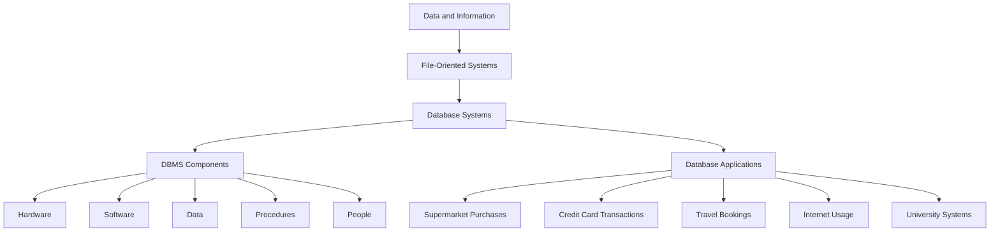

In the world of data management, the evolution of database technology marks a significant transformation in how we collect, store, and utilize data. This evolution reflects advancements in computing power, software development, and the increasing importance of data as a corporate resource. Let's explore this journey from basic file-oriented systems to sophisticated database management systems (DBMS).

## The Beginning: Data and Information

The foundation of any database system is data. Data consists of raw, unprocessed facts such as text, numbers, images, and other media that can be used for communication, interpretation, or processing by humans or automated systems. When data is processed, organized, or summarized, it transforms into information, which is crucial for decision-making and operations in any organization.

### The Importance of Data Management

Data has increasingly become a vital corporate resource, driving the need for efficient data management and processing systems. Organizations rely on databases to handle vast amounts of data, enabling them to perform queries and generate reports essential for their operations.

## File-Oriented Systems: The Early Days

Initially, data was managed using file-oriented systems. These systems were designed to meet the need for random access processing but came with several limitations:

- **Data Redundancy**: Data was often duplicated across different files, leading to inefficiencies.
- **Inadequate Data Manipulation**: File-oriented systems lacked advanced capabilities to manipulate data effectively.
- **Program-Data Dependency**: Data definitions were embedded within application programs, making it challenging to modify data structures without altering the entire program.
- **Lack of Data Independence**: Changes in data structure required changes in the application programs as well, reducing flexibility.

### Examples of File-Based Systems

In file-based systems, each application program defined and managed its own data, resulting in data isolation and duplication. For example, libraries used card catalogues to store information about books, with each card containing specific details like the title, author, and subject.

## The Advent of Database Systems

The limitations of file-oriented systems led to the development of database systems, which introduced a more efficient approach to data management. A database is a shared collection of logically related data, designed to meet the information needs of an organization.

### Components of a Database System Environment

A database system environment comprises several components:

- **Hardware**: Physical devices on which the database resides, ranging from personal computers to networks of servers.
- **Software**: Includes the DBMS, operating system, application programs, and user interface.
- **Data**: The actual data stored in the database, along with the schema, which describes the data's structure.
- **Procedures**: Instructions and rules for the design and use of the database.
- **People**: End-users who need information from the database and practitioners responsible for managing the database system.

### The Database Approach

The database approach arose to address the deficiencies of file-oriented systems by introducing:

- **Program-Data Independence**: Storing data definitions separately from application programs.
- **Controlled Data Access**: Managing data access and manipulation through the DBMS, ensuring data integrity and security.

### Database Management System (DBMS)

A DBMS is a software system that enables users to define, create, and maintain a database while providing controlled access to the data. It supports data independence, reduces redundancy, and improves data integrity.

### Examples of Database Applications

Databases are used in various applications, such as:

- **Supermarket Purchases**: Tracking inventory and sales.
- **Credit Card Transactions**: Managing customer accounts and transactions.
- **Travel Bookings**: Storing information about flights, hotels, and reservations.
- **Internet Usage**: Managing user accounts, content, and interactions.
- **University Systems**: Handling student information, courses, and grades.

## Manual Systems and Their Evolution

Before digital databases, manual systems like library card catalogues were used to manage information. These systems were labor-intensive and prone to errors. The transition to digital databases provided significant improvements in efficiency and accuracy.

### Limitations of File-Based Systems

File-based systems faced several challenges:

- **Separation and Isolation of Data**: Each program maintained its own data set, leading to data silos.
- **Duplication of Data**: Same data stored in multiple locations, causing inconsistencies.
- **Data Dependence**: Data structure changes required program modifications.
- **Incompatible File Formats**: Programs written in different languages couldn't easily share data.
- **Fixed Queries**: New requirements often necessitated new programs.

## Data Hierarchy in Databases

Data in databases is organized hierarchically:

- **Entities/Objects**: Represent real-world objects like employees or departments.
- **Attributes**: Characteristics of entities, such as name, address, or salary.
- **Byte**: Represents a single character using a group of bits.
- **Bit**: The smallest unit of data, representing a binary value (0 or 1).

### Example Data Hierarchy

An example of a data hierarchy might include:

- **Employee**: Attributes like employee number, name, designation, salary, and department.
- **Department**: Attributes like department name, manager, address, and phone number.

## Conclusion

The evolution of database technology has transformed how organizations manage and utilize data. From the limitations of file-oriented systems to the advanced capabilities of modern DBMS, the journey reflects continuous improvements in efficiency, data integrity, and accessibility. Understanding this evolution helps appreciate the sophisticated database systems that underpin today's data-driven world.

