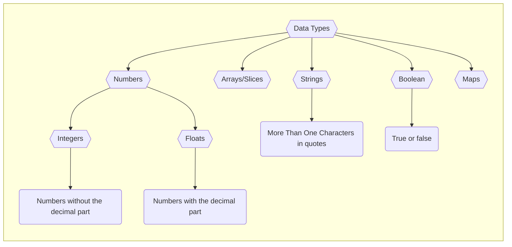

Have you ever wondered what makes Go (or Golang) such a popular programming language? Developed by Google, Go is known for its simplicity and speed, making it a great choice for building reliable software. Whether you're new to programming or looking to expand your skills, learning Go can open up exciting opportunities. This blog post will guide you through the basics of Go programming, helping you understand its key concepts and how to use them in your projects.

## Writing Your First Program

Before we dive into the complexities of Go programming, let's start with the basics. In this section, we'll write a simple Go program that prints "Hello, World!" to the console. This will help you get familiar with the syntax and structure of a typical Go program.

Open your favorite text editor and create a new file named `hello.go`. In this file, we'll write a basic "Hello, World!" program using the `fmt` package, which provides functions for formatting text output.

```go title="hello.go"
package main

import "fmt"

func main() {
    fmt.Println("Hello, World!")
}
```

### Understanding the Program

`package main`: This line declares that this is a Go executable package. Every Go program must start with a package declaration. The main package is special—it's the entry point for the executable programs.

`import "fmt"`: This line imports the fmt package, which stands for "format." It provides functions for formatting input and output. We use `fmt.Println()` to print a message to the console.

`func main() {...}`: This is the main function of our program. It's where the execution of our program begins. In this function, we use `fmt.Println()` to print "Hello, World!" to the console.

**Running Your Program**
To run your program, open a terminal, navigate to the directory containing hello.go, and run the following command:

```shell
go run hello.go
```

You should see the output Hello, World! printed to the console. Congratulations, you've just written and executed your first Go program!

### Understanding Comments in Go

Comments in Go are used to add explanations or notes within the code. They are ignored by the compiler during compilation. There are two types of comments in Go:

**Single-Line Comments**: Start with `//` and continue until the end of the line.

```go
// This is a single-line comment
```

**Multi-Line Comments**: Start with `/*` and end with `*/`. They can span multiple lines.

```go
/*
This is a
multi-line comment
*/
```

Comments should be used sparingly to complement the code, not duplicate it. They should be clear, concise, and updated as the code changes.

### Understanding Data Types and Variables in Go

In Go, like in any programming language, data types and variables are fundamental concepts. Understanding how they work is crucial for writing effective and efficient code. This section will cover the basic data types available in Go and how to work with variables.


