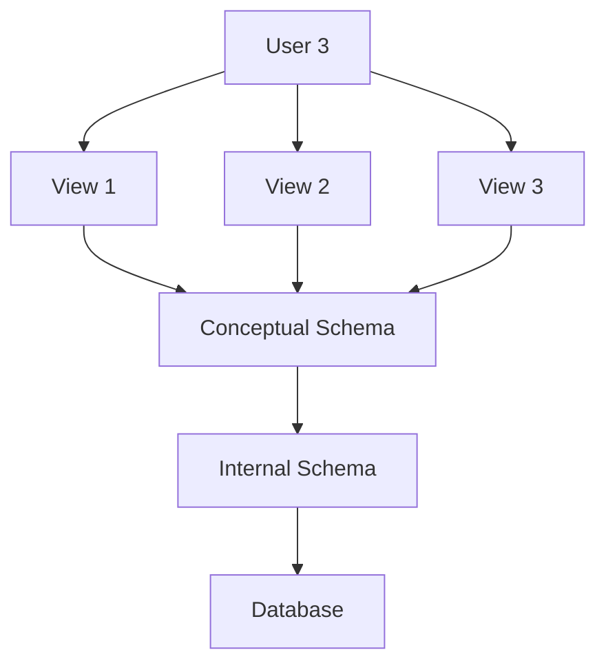

Databases are the backbone of modern information systems, enabling efficient data management, retrieval, and storage. In this blog post, we'll explore the core components of database architecture, the ANSI/SPARC Three-Level Architecture, and key data specification and access mechanisms.

## Components of a Database Management System

A Database Management System (DBMS) is a complex suite of software that provides an efficient way to store, modify, and retrieve data. Key components include:

### Data Dictionary

The data dictionary is a critical part of the DBMS, acting as a centralized repository for metadata, which describes the structure and properties of the data in the database. It contains:

- **Elementary-level data items**: Fields and attributes that define the smallest units of data.
- **Group and record-level data structures**: Definitions of how individual fields are grouped into records.
- **Files or relational tables**: Information about the storage of data in structured formats.

### Meta Data

Metadata is data about data, providing essential information about each data item, such as:

- **Name**: The identifier for the data item.
- **Data type**: The type of data (e.g., integer, string).
- **Length**: The maximum length of the data.
- **Constraints**: Rules governing the data (e.g., minimum and maximum values).

#### Example: Employee Metadata

| Name  | Type     | Length | Min  | Max    | Description     |
|-------|----------|--------|------|--------|-----------------|
| EmpNo | Number   | 9      | -    | -      | Employee No.    |
| Name  | Character| 30     | -    | -      | Employee Name   |
| Dept  | Character| 10     | -    | -      | Department No.  |
| Salary| Number   | 8      | 5000 | 60000  | Employee Salary |

### Data Security and Integrity

- **Data security**: Protects data against unauthorized access and corruption.
- **Data integrity**: Ensures the accuracy and validity of data within the database.

### Concurrent Access

Concurrent access in database systems allows multiple users to interact with the database simultaneously, enhancing data availability and reliability.

### User-oriented Data Query and Reporting

DBMSs provide user-friendly query and reporting tools, enabling users to retrieve and analyze data efficiently.

### Application Development Facilities

These facilities support the creation of database applications, allowing developers to define rules and operations to manage data effectively.

## The ANSI/SPARC Three-Level Architecture

The ANSI/SPARC Three-Level Architecture standardizes database design, ensuring data independence and a clear separation between different levels of data abstraction.

### External Level

This level represents the user's view of the database, providing a customized and simplified perspective of the data.

### Conceptual Level

The conceptual level describes the logical structure of the entire database, encompassing all entities, their attributes, and relationships.

### Internal Level

This level details the physical storage of data, including data structures and file organization methods.

### Visualization

### Data Specification and Access Mechanisms
#### Data Definition Language (DDL)
DDL allows the definition of database structures, including data types and constraints.

#### Data Manipulation Language (DML)
DML provides the means to query and modify data, with both non-procedural and procedural variants available.

#### Database Administrator Functions
The Database Administrator (DBA) is responsible for managing the DBMS, ensuring data security, and optimizing performance.

#### Capabilities of DBMS
DBMSs offer numerous capabilities, including:

- Self-describing nature: The DBMS includes metadata about the database structure.
- Program-data independence: Changes to data structures do not require changes to application programs.
- Support for multiple views: Different users can have customized views of the same data.

## Advantages and Disadvantages
The database approach offers numerous benefits, such as improved data sharing, consistency, and security. However, it also has drawbacks, including complexity and cost.

### Conclusion
Understanding the components and architecture of a DBMS is essential for effective database management. The ANSI/SPARC Three-Level Architecture provides a robust framework for designing and maintaining complex databases, ensuring data independence and integrity.
