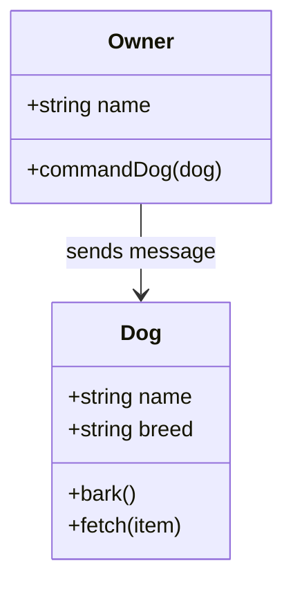

In object-oriented programming (OOP), **methods** and **messages** are crucial concepts that facilitate interaction between objects. This blog post will explore what methods are, how they function within classes, and how messages enable communication between objects.

### What is a Method?

A **method** is a procedure associated with a class that defines the behavior of the objects created from that class. Each method can perform actions or manipulate the object's data, allowing for encapsulated functionality. Methods are fundamental to OOP as they enable code reusability and maintainability.

#### Key Characteristics of Methods

- **Defined within Classes**: Methods are created as part of a class definition and are accessible to any object instantiated from that class.
- **Instance-Specific**: When a method is called on an object, it operates within the context of that specific object, accessing its attributes and state.
- **Multiple Methods**: A class can contain multiple methods, each serving different functionalities.

### Example of Methods in JavaScript

Here’s a simple example illustrating how methods work in a JavaScript class:

```javascript
class Dog {
    constructor(name, breed) {
        this.name = name;
        this.breed = breed;
    }

    bark() {
        console.log(`${this.name} says Woof!`);
    }

    fetch(item) {
        console.log(`${this.name} fetched the ${item}.`);
    }
}

// Creating an instance of Dog
const myDog = new Dog("Buddy", "Golden Retriever");
myDog.bark(); // Output: Buddy says Woof!
myDog.fetch("ball"); // Output: Buddy fetched the ball.
```

### What is a Message?

In OOP, a **message** is a way for objects to communicate with one another. When an object wants another object to perform an action, it sends a message. This interaction is often done through method calls.

#### Characteristics of Messages

- **Encapsulation**: Objects do not need to know the internal workings of other objects; they only need to know how to send messages (method calls) and interpret responses.
- **Decoupling**: By using messages, objects can interact without being tightly coupled, enhancing modularity and flexibility in code design.

### Example of Message Passing

Continuing with our `Dog` example, let’s illustrate message passing:

```javascript
class Owner {
    constructor(name) {
        this.name = name;
    }

    commandDog(dog) {
        console.log(`${this.name} commands:`);
        dog.bark(); // Sending a message to the dog object
    }
}

// Creating an instance of Owner
const owner = new Owner("Alice");
owner.commandDog(myDog); // Output: Alice commands: Buddy says Woof!
```

### Class Diagram Representation

To visualize the relationship between methods and messages in OOP, we can use Mermaid.js to create a class diagram:



### Conclusion

Methods and messages are integral components of object-oriented programming that facilitate interaction between objects. Methods define the behaviors that objects can perform, while messages enable communication between these objects. Understanding these concepts enhances your ability to design modular and maintainable software systems.

By leveraging methods for encapsulated functionality and messages for object interaction, developers can create robust applications that mirror real-world relationships effectively. This approach not only improves code organization but also enhances reusability across different parts of the application.

Sources

- [1] What is a method (in object-oriented programming)? - TechTarget <https://www.techtarget.com/whatis/definition/method>
- [2] Object-Oriented Programming: Objects, Classes & Methods - Lessonstudy.com › ... › Computer Programming <https://study.com/academy/lesson/oop-object-oriented-programming-objects-classes-interfaces.html>
- [3] Method (computer programming) - Wikipedia <https://en.wikipedia.org/wiki/Method_(computer_programming)>
- [4] Object-oriented programming - Wikipedia <https://en.wikipedia.org/wiki/Object_oriented>
- [5] What is Object-Oriented Programming (OOP)? | Definition from TechTarget <https://www.techtarget.com/searchapparchitecture/definition/object-oriented-programming-OOP>
- [6] Introduction of Object Oriented Programming - GeeksforGeeks <https://www.geeksforgeeks.org/introduction-of-object-oriented-programming/>
